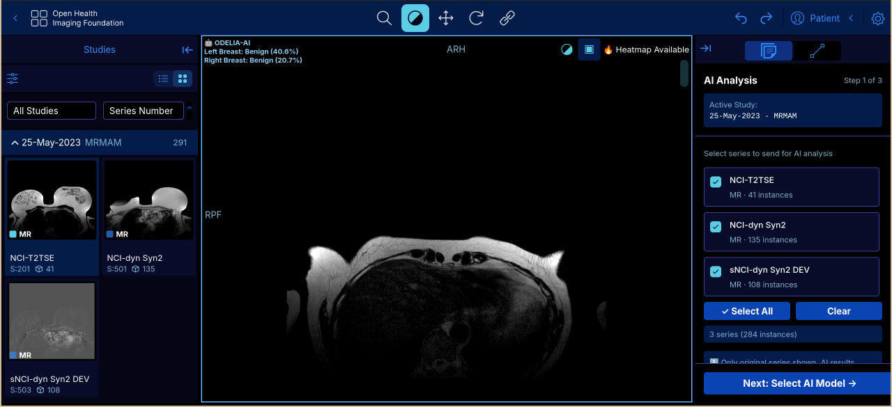
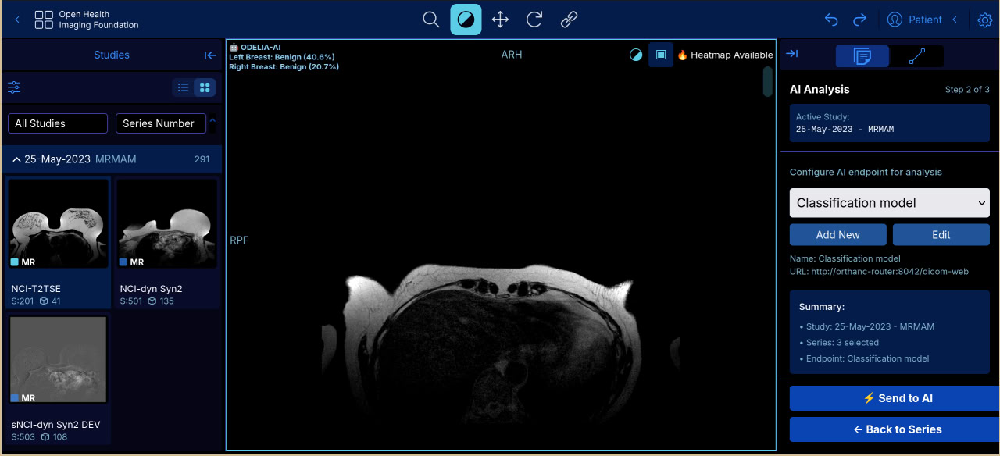
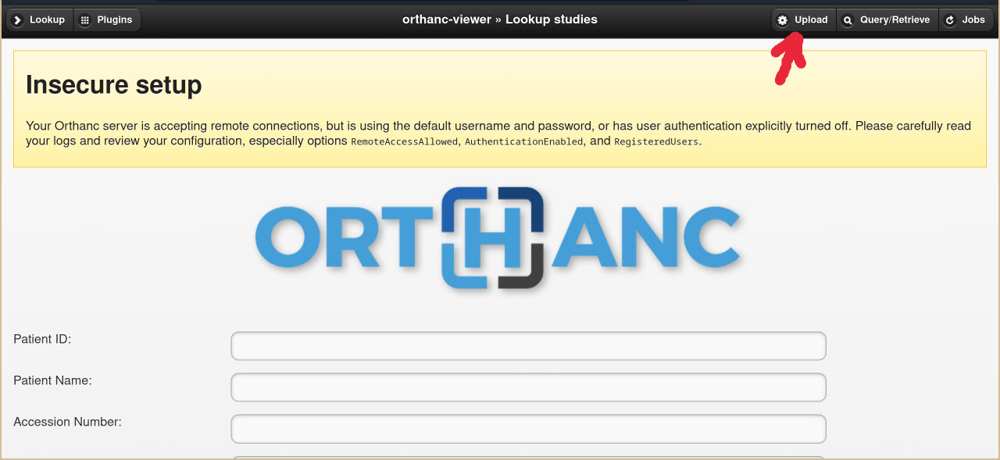

# Odelia Viewer Deployment Guide

## Overview 🎯
This repository provides deployment instructions for the Odelia Viewer, a medical imaging platform for Odelia AI integration.

## Quick Start ⚡
1. Clone the repository:
   ```bash
   git clone --recurse-submodules  https://github.com/StratifAI-Research/odelia-deployment
   cd odelia-deployment
   ```

2. Make sure you have Docker installed on your computer
3. Open a terminal in the project directory

> **Note:** When running for the first time, you may see warnings about not being able to pull images for:
> - `odelia-orthanc-router`
> - `odelia-orthanc-viewer`
> - `odelia-breast-cancer-classification`
> - `odelia-mst-classifier`
>
> This is normal - these images will be built from source automatically.

4. Run the following command:
   ```bash
   docker compose up -d
   ```
5. Open your web browser and navigate to `http://localhost:8081`

> **Note:** All configurations are pre-set for `http://localhost:8081`. No changes needed for local deployment!

<details>
<summary>For production deployments: Replace domain/host checklist</summary>

When deploying to a server or custom domain, update these locations:

- `docker-compose.yml`
  - `KC_HOSTNAME_URL` and `KC_HOSTNAME_ADMIN_URL`: set to `https://YOUR_DOMAIN/keycloak/` (use `http://` if not using TLS).
  - Keycloak healthcheck: replace `YOUR_DOMAIN` and the `host:` header to reflect your domain.

- `config/app-config.js`
  - `oidc[0].authority`: keep `'/keycloak/realms/ohif'` if Nginx proxies Keycloak at `/keycloak/`; otherwise use `https://YOUR_DOMAIN/keycloak/realms/ohif`.
  - `oidc[0].redirect_uri`: keep `'/viewer/callback'` and allow it in Keycloak client settings.
  - `oidc[0].post_logout_redirect_uri`: keep `'/viewer/'` and ensure it is permitted in Keycloak client settings.

- `config/ohif-keycloak-realm.json`
  - If you rely on realm auto-import, adjust (or update in UI post-import): `rootUrl`, `adminUrl`, `baseUrl`, `redirectUris`, and `webOrigins` to `https://YOUR_DOMAIN`.

- `config/nginx.conf`
  - Optional: set `server_name` to your domain if desired.
  - Keycloak is reverse-proxied at `/keycloak/`; keeping OHIF `authority` relative simplifies domain moves.
  - Note: `/oauth2/*` blocks are legacy (oauth2-proxy). They are unused with internal OIDC and can be removed later.

- This README
  - Replace any remaining `localhost` URLs if your deployment uses a different host/port.

</details>

## Architecture Overview 🔄
The send to AI pipeline consists of the following components:

1. **Odelia Viewer**: OHIF based viewer, customized with AI routing and feedback features
2. **Local Orthanc Instance**: Acts as the DICOM server, receiving and managing medical images
3. **Orthanc Router**: The traffic controller that:
   - Receives studies from the local Orthanc
   - Routes them to the appropriate AI model
   - Receives AI inference results
   - Wraps the results in DICOM format
   - Sends everything back to the viewer
4. **AI Model**: The AI model that receives the studies and returns the inference results

## Use Cases 💡
<details>
<summary>AI Routing</summary>

Send studies to AI models for analysis using the **AI Analysis** panel (right sidebar):

1. **Open a study** - The panel automatically detects the active study

   

2. **Select series** - Choose which series to analyze and click "Next"

3. **Select AI model** and click "Send to AI"
   - Classification model (breast cancer)
   - MST AI model (requires HF_TOKEN)

   

4. **View results** - AI-processed studies appear in the study list with annotations

</details>

<details>
<summary>Uploading Images to Orthanc</summary>

Upload DICOM images using one of these methods:

**Method 1: OHIF Viewer** (Recommended)
- Open viewer at `http://localhost:8081`
- Use the upload button to drag and drop DICOM files



**Method 2: Orthanc Web Interface**
- Access `http://localhost:8000`
- Click "Upload" and select DICOM files (`.dcm`)

**Method 3: DICOM Send (C-STORE)**
- Configure your DICOM source: AE Title `ORTHANC-VIEWER`, Host `localhost`, Port `2000`
- Send studies from your PACS workstation

</details>

## Directory Structure 📁
The deployment uses the following structure:
```
├── docker-compose.yml
├── config/                         # Deployment configuration
│   ├── app-config.js               # OHIF viewer settings (OIDC, DICOMWeb)
│   ├── nginx.conf                  # Nginx reverse proxy
│   ├── ohif-keycloak-realm.json    # Keycloak realm import (ohif)
│   ├── orthanc-router.json         # Orthanc router config
├── grafana/
│   └── provisioning/...
└── volumes/                        # Persistent data volumes
    ├── orthanc-viewer-db/
    └── feedback-db/
```

## Configuration ⚙️
The viewer comes pre-configured for most use cases. If you need to make changes:
1. The main configuration file is located in `config/app-config.js`
2. Web server settings can be modified in `config/nginx.conf`

## Keycloak Configuration 🔐
<details>
<summary>View Keycloak setup</summary>

Odelia Viewer uses OHIF's internal OIDC module to authenticate directly with Keycloak (no oauth2-proxy). Nginx exposes Keycloak at `/keycloak/` so OHIF can use a relative OIDC `authority`.

- Admin Console: `http://localhost:8081/keycloak` (replace with your domain in production)
- Realm import: `config/ohif-keycloak-realm.json` is auto-imported at container start
- Default admin credentials: `admin` / `admin`

In Keycloak UI (Realm: `ohif` → Client: `ohif_viewer`), set for YOUR_DOMAIN:

- Root URL: `https://YOUR_DOMAIN`
- Home URL: `https://YOUR_DOMAIN`
- Valid Redirect URIs: `https://YOUR_DOMAIN/callback`
- Web Origins: `https://YOUR_DOMAIN`
- Post Logout Redirect URIs: `https://YOUR_DOMAIN/*` (or your exact path)

If you change domains or enable TLS, also set in compose (service `keycloak`):

- `KC_HOSTNAME_URL=https://YOUR_DOMAIN/keycloak/`
- `KC_HOSTNAME_ADMIN_URL=https://YOUR_DOMAIN/keycloak/`

Troubleshooting:

- "invalid parameter: redirect_uri": fix Redirect URIs/Web Origins in the `ohif_viewer` client.
- CORS errors: ensure Web Origins matches your scheme + domain.
- References: [User Account Control](https://docs.ohif.org/deployment/user-account-control/), [Authorization (OIDC)](https://docs.ohif.org/deployment/authorization/)

</details>

## AI Model Configuration 🤖
<details>
<summary>Configure Hugging Face access for MST classifier model</summary>

The MST Classification model requires authentication to access models from Hugging Face. This is configured via the `HF_TOKEN` environment variable in the `mst-classifier` service (line 146 in `docker-compose.yml`).

### Obtaining a Hugging Face Token

1. Create a free account at [https://huggingface.co](https://huggingface.co) if you don't have one
2. Navigate to Settings → Access Tokens
3. Click "Create new token"
4. Give it a name (e.g., "odelia-mst") and select "Read" access
5. Copy the generated token

### Required Model Licenses

Before using the MST classifier, you **must** accept the licenses for the following models:

1. **ODELIA-AI/MST** - [https://huggingface.co/ODELIA-AI/MST](https://huggingface.co/ODELIA-AI/MST)
   - Research-only use, non-commercial
   - You must agree to the Model Usage Agreement
   - Log in to Hugging Face and accept the conditions on the model page

2. **DINOv3** (required dependency) - [https://huggingface.co/facebook/dinov3-vits16-pretrain-lvd1689m](https://huggingface.co/facebook/dinov3-vits16-pretrain-lvd1689m)
   - You must accept the DINOv3 License terms
   - Log in to Hugging Face and accept the conditions on the model page

### Configuring the Token

**Option 1: Edit docker-compose.yml (Recommended)**
Replace the placeholder in `docker-compose.yml`:
```yaml
environment:
  HF_TOKEN: "your_actual_token_here"  # Replace HF_TOKEN with your token
```

**Option 2: Environment Variable**
```bash
export HF_TOKEN=your_actual_token_here
docker compose up -d
```

> ⚠️ **Security Warning:** Never commit your actual token to git. Consider using a `.env` file (add it to `.gitignore`) or environment variables for sensitive tokens.

### Note

- The default **breast-cancer-classification** model does not require a Hugging Face token
- The `HF_TOKEN` is only needed if you're using the **MST classifier** model
- Both models are available in the deployment and can be selected in the viewer

</details>

## Accessing the Viewer 🌐
- Local deployment: `http://localhost:8081`
- Remote deployment: `http://your-server-address:8081`

## Support 🤝
If you encounter any issues or need assistance:

### Collecting Logs for Support
To help us diagnose issues, please collect logs from all components:

1. **Viewer Logs**
   ```bash
   docker logs odelia-viewer > logs/viewer.log
   ```

2. **Orthanc Logs**
   ```bash
   docker logs odelia-orthanc-viewer > logs/orthanc.log
   ```

3. **Router Logs**
   ```bash
   docker logs odelia-orthanc-router > logs/router.log
   ```

4. **System Logs**
   ```bash
   # Collect Docker system logs
   docker system info > logs/docker-info.log
   docker ps -a > logs/containers.log
   ```

5. **Configuration Files**
   ```bash
   # Copy current configuration
   cp config/* logs/
   ```

Once you've collected all logs, please:
1. Compress the `logs` directory
2. Contact the us at b.maksudov@lua.tatar
3. Provide a description of the issue
4. Attach the compressed logs
