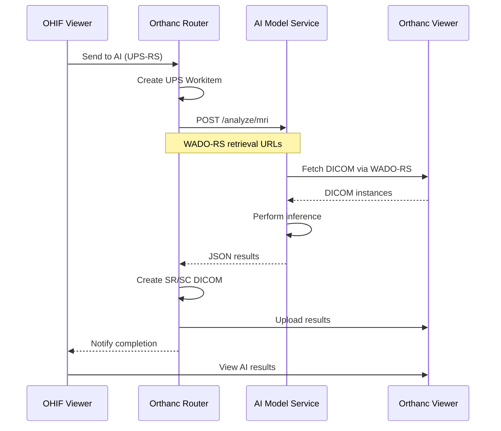

# Adding Custom AI Models to Odelia Viewer

This guide explains how to integrate custom AI models into the Odelia Viewer platform for medical image analysis.

## Overview

The Odelia Viewer provides a standardized architecture for integrating AI models that analyze medical images (specifically breast MRI studies). Your custom model will receive DICOM data via WADO-RS retrieval, perform inference, and return results that are automatically converted to DICOM format and displayed in the viewer.

## Architecture

The AI integration follows this workflow:



### Key Components

- **OHIF Viewer**: Frontend application where users interact with studies
- **Orthanc Router**: Orchestrates AI workflow via UPS-RS protocol
- **AI Model Service**: Your custom model (Flask microservice)
- **Orthanc Viewer**: DICOM storage that serves images via WADO-RS

## Input Format

Your AI model service must implement a `POST /analyze/mri` endpoint that accepts the following JSON format:

```json
{
  "wado_rs_retrieval": [
    {
      "retrieval_url": "http://orthanc-viewer:8042/dicom-web/studies/1.2.3.../series/1.2.3...",
      "study_uid": "1.2.840.113619.2...",
      "series_uid": "1.2.840.113619.2..."
    }
  ],
  "study_uid": "1.2.840.113619.2..."
}
```

### Field Descriptions

- `wado_rs_retrieval`: Array of series to retrieve
- `retrieval_url`: Full WADO-RS URL for retrieving the series
- `study_uid`: DICOM StudyInstanceUID
- `series_uid`: DICOM SeriesInstanceUID for each series

This format is sent by the orthanc-router's UPS processor when a user requests AI analysis.

## Output Format

Your model must return one of two JSON response formats. The router detects the format automatically and creates appropriate DICOM objects.

### Format 1: Bilateral Classification (Basic)

For models that return simple classification results:

```json
{
  "left": {
    "prediction": "Cancerous",
    "confidence": 87.5
  },
  "right": {
    "prediction": "Not Cancerous",
    "confidence": 65.2
  }
}
```

**Requirements:**
- `prediction`: String classification label
- `confidence`: Numeric confidence score (0-100)

The router creates a **DICOM Structured Report (SR)** with these results.

### Format 2: Bilateral with Attention Maps (Advanced)

For models that return attention/heatmap visualizations:

```json
{
  "left": {
    "prediction": "Malignant",
    "confidence": 87.5
  },
  "right": {
    "prediction": "Benign",
    "confidence": 65.2
  },
  "attention_maps": {
    "data": "base64_encoded_numpy_array",
    "shape": [64, 256, 256],
    "dtype": "float32"
  }
}
```

**Additional Requirements:**
- `attention_maps.data`: Base64-encoded numpy array
- `attention_maps.shape`: Array dimensions [num_slices, height, width]
- `attention_maps.dtype`: Numpy dtype string (e.g., "float32")

The router creates both a **DICOM SR** and a **Multi-frame Secondary Capture (SC)** with heatmap overlays.

### Encoding Attention Maps

Example Python code to encode attention maps:

```python
import numpy as np
import base64

# Your attention maps as numpy array: shape (num_slices, height, width)
attention_array = np.random.rand(64, 256, 256).astype(np.float32)

# Encode for response
attention_maps = {
    "data": base64.b64encode(attention_array.tobytes()).decode('utf-8'),
    "shape": list(attention_array.shape),
    "dtype": str(attention_array.dtype)
}
```

## Shared Utilities Library

The `MLIntegration/shared/` package provides reusable utilities for building AI services. These utilities handle common tasks like DICOM retrieval, storage, and Orthanc communication.

### Installation

The shared package is automatically installed when you build your Docker image. In your Dockerfile:

```dockerfile
# Copy and install shared package
COPY shared/ ./shared/
COPY setup.py pyproject.toml ./
RUN pip install --no-cache-dir -e .
```

### Available Modules

#### 1. WADO-RS Retrieval (`shared.wado_retrieval`)

Retrieve DICOM instances via DICOMweb WADO-RS protocol.

```python
from shared.wado_retrieval import retrieve_via_wado_rs

# Retrieve DICOM datasets from WADO-RS URLs
datasets = retrieve_via_wado_rs(
    wado_rs_retrieval=[{
        "retrieval_url": "http://orthanc-viewer:8042/dicom-web/studies/.../series/...",
        "study_uid": "1.2.3...",
        "series_uid": "1.2.3..."
    }],
    orthanc_url="http://orthanc-viewer:8042"
)

# datasets is a List[pydicom.Dataset]
for ds in datasets:
    print(ds.PatientName, ds.SeriesDescription)
```

#### 2. Configuration (`shared.config`)

Dataclasses for service configuration.

```python
from shared.config import OrthancConfig, StorageConfig
from pathlib import Path

# Orthanc server configuration
orthanc_config = OrthancConfig(
    url="http://orthanc-viewer:8042",
    verify_ssl=False,
    timeout=30
)

# Storage configuration
storage_config = StorageConfig(
    image_folder=Path("./images"),
    cleanup_on_start=True
)
```

#### 3. DICOM Storage (`shared.dicom_storage`)

Save DICOM datasets to disk.

```python
from shared.dicom_storage import save_datasets_to_folder

# Save retrieved datasets to folder
dicom_folder = save_datasets_to_folder(
    datasets=datasets,
    series_uid="1.2.3...",
    storage_config=storage_config
)

# Returns Path to folder containing DICOM files
print(f"DICOM files saved to: {dicom_folder}")
```

#### 4. Orthanc Client (`shared.orthanc_client`)

REST API client for Orthanc server (for advanced use cases).

```python
from shared.orthanc_client import OrthancClient

client = OrthancClient(orthanc_config)

# Lookup series by UID
series_id = client.get_series_id_by_uid("1.2.840.113619...")

# Download instances
dicom_files = client.download_series_instances(series_id)
```

#### 5. Exceptions (`shared.exceptions`)

Custom exception types for error handling.

```python
from shared.exceptions import (
    DicomRetrievalError,
    OrthancCommunicationError,
    SeriesNotFoundError
)

try:
    datasets = retrieve_via_wado_rs(wado_rs_retrieval)
except DicomRetrievalError as e:
    logger.error(f"Failed to retrieve DICOM: {e}")
```

### Retrieval Strategies

The codebase uses a Strategy pattern for DICOM retrieval. See `breast-cancer-classification/retrieval_strategy.py` for reference:

```python
from retrieval_strategy import WadoRSRetrieval

# Create retrieval strategy
strategy = WadoRSRetrieval(
    wado_rs_retrieval=request_data["wado_rs_retrieval"],
    orthanc_config=orthanc_config,
    storage_config=storage_config
)

# Execute retrieval
dicom_folder, series_uid = strategy.retrieve()
```

## Implementation Guide

### Step 1: Create Model Service Directory

Create a new directory for your model under `MLIntegration/`:

```bash
cd custom/deploy/orthanc-routing-example/MLIntegration
mkdir your-model-name
cd your-model-name
```

### Step 2: Implement Flask Service

Create `app_refactored.py` with the following structure:

```python
"""
Your Model Service - Flask microservice
"""
import os
import logging
from pathlib import Path
from flask import Flask, request, jsonify
from flask_cors import CORS

from shared.config import OrthancConfig, StorageConfig
from config import YourModelConfig
from model_service import YourModelService
from exceptions import ModelNotLoadedError, InferenceError

# Set up logging
logging.basicConfig(level=logging.INFO)
logger = logging.getLogger(__name__)

# Initialize Flask app
app = Flask(__name__)
CORS(app)

# Global model service
model_service: YourModelService = None


def initialize_service():
    """Initialize configurations and model service"""
    global model_service

    # Load configurations from environment
    model_config = YourModelConfig.from_env()

    orthanc_config = OrthancConfig(
        url=os.getenv("ORTHANC_URL", "http://orthanc:8042"),
        verify_ssl=False,
        timeout=30
    )

    storage_config = StorageConfig(
        image_folder=Path(os.getenv("IMAGE_FOLDER", "./images")),
        cleanup_on_start=True
    )

    # Create necessary directories
    os.makedirs(storage_config.image_folder, exist_ok=True)

    # Initialize model service
    model_service = YourModelService(model_config, orthanc_config, storage_config)
    model_service.initialize_model()


@app.route("/health", methods=["GET"])
def health_check():
    """Health check endpoint"""
    return jsonify(model_service.get_health_status())


@app.route("/analyze/mri", methods=["POST"])
def analyze_mri():
    """
    Analyze MRI series using your model

    Expects:
    {
        "wado_rs_retrieval": [...],
        "study_uid": "1.2.3..."
    }

    Returns:
    {
        "left": {"prediction": "...", "confidence": 87.5},
        "right": {"prediction": "...", "confidence": 65.2}
    }
    """
    try:
        # Delegate all logic to model service
        result = model_service.analyze_mri_series(request.json)
        return jsonify(result)

    except ModelNotLoadedError as e:
        logger.error(f"Model not loaded: {e}")
        return jsonify({"error": "Model not loaded"}), 503

    except ValueError as e:
        logger.error(f"Invalid request: {e}")
        return jsonify({"error": str(e)}), 400

    except InferenceError as e:
        logger.error(f"Inference error: {e}")
        return jsonify({"error": str(e)}), 500

    except Exception as e:
        logger.error(f"Unexpected error: {e}")
        import traceback
        traceback.print_exc()
        return jsonify({"error": f"Internal server error: {str(e)}"}), 500


if __name__ == "__main__":
    # Initialize service before starting server
    initialize_service()

    # Start Flask server (choose unique port)
    logger.info("Starting Flask server on 0.0.0.0:5557")
    app.run(host="0.0.0.0", port=5557, debug=False, use_reloader=False)
```

### Step 3: Create Model Service Logic

Create `model_service.py` to handle the core logic:

```python
"""
Model service - handles DICOM retrieval, preprocessing, inference, and response
"""
import logging
from pathlib import Path
from typing import Dict

from shared.wado_retrieval import retrieve_via_wado_rs
from shared.dicom_storage import save_datasets_to_folder
from retrieval_strategy import WadoRSRetrieval
from exceptions import ModelNotLoadedError, InferenceError

logger = logging.getLogger(__name__)


class YourModelService:
    """Service for model inference"""

    def __init__(self, model_config, orthanc_config, storage_config):
        self.model_config = model_config
        self.orthanc_config = orthanc_config
        self.storage_config = storage_config
        self.model = None

    def initialize_model(self):
        """Load the model"""
        logger.info("Loading model...")
        # Load your model here
        # self.model = load_model(self.model_config.model_path)
        logger.info("Model loaded successfully")

    def get_health_status(self) -> Dict:
        """Return health status"""
        return {
            "status": "healthy" if self.model is not None else "unhealthy",
            "model_loaded": self.model is not None
        }

    def analyze_mri_series(self, request_data: Dict) -> Dict:
        """
        Analyze MRI series

        Args:
            request_data: Request JSON with wado_rs_retrieval

        Returns:
            Response dict with bilateral classification
        """
        if self.model is None:
            raise ModelNotLoadedError("Model not loaded")

        # Validate input
        if "wado_rs_retrieval" not in request_data:
            raise ValueError("Missing wado_rs_retrieval in request")

        wado_rs_retrieval = request_data["wado_rs_retrieval"]
        study_uid = request_data.get("study_uid", "unknown")

        logger.info(f"Analyzing study {study_uid}")

        # Step 1: Retrieve DICOM data via WADO-RS
        strategy = WadoRSRetrieval(
            wado_rs_retrieval=wado_rs_retrieval,
            orthanc_config=self.orthanc_config,
            storage_config=self.storage_config
        )

        dicom_folder, series_uid = strategy.retrieve()
        logger.info(f"Retrieved DICOM to {dicom_folder}")

        # Step 2: Preprocess data
        # preprocessed_data = preprocess(dicom_folder)

        # Step 3: Run inference
        # predictions = self.model.predict(preprocessed_data)

        # Step 4: Format response
        response = {
            "left": {
                "prediction": "Example Result",
                "confidence": 85.0
            },
            "right": {
                "prediction": "Example Result",
                "confidence": 90.0
            }
        }

        return response
```

### Step 4: Create Supporting Files

Create `config.py`:

```python
"""Configuration for your model service"""
import os
from dataclasses import dataclass
from pathlib import Path


@dataclass
class YourModelConfig:
    """Configuration specific to your model"""
    model_path: Path

    @classmethod
    def from_env(cls):
        """Load configuration from environment variables"""
        return cls(
            model_path=Path(os.getenv("MODEL_PATH", "./models/your_model.pth"))
        )
```

Create `exceptions.py`:

```python
"""Custom exceptions for your model service"""


class ModelNotLoadedError(Exception):
    """Raised when model is not loaded"""
    pass


class InferenceError(Exception):
    """Raised when inference fails"""
    pass
```

Create `retrieval_strategy.py` (or reuse from existing models):

```python
"""
Retrieval strategies for DICOM data
"""
import logging
from pathlib import Path
from typing import Tuple

from shared.wado_retrieval import retrieve_via_wado_rs
from shared.dicom_storage import save_datasets_to_folder
from shared.config import OrthancConfig, StorageConfig

logger = logging.getLogger(__name__)


class WadoRSRetrieval:
    """WADO-RS retrieval strategy"""

    def __init__(self, wado_rs_retrieval: list, orthanc_config: OrthancConfig, storage_config: StorageConfig):
        self.wado_rs_retrieval = wado_rs_retrieval
        self.orthanc_config = orthanc_config
        self.storage_config = storage_config

    def retrieve(self) -> Tuple[Path, str]:
        """
        Retrieve DICOM via WADO-RS

        Returns:
            Tuple of (dicom_folder_path, series_uid)
        """
        logger.info("Using WADO-RS retrieval")

        # Retrieve DICOM datasets
        datasets = retrieve_via_wado_rs(self.wado_rs_retrieval, orthanc_url=self.orthanc_config.url)

        if not datasets:
            raise ValueError("No DICOM instances retrieved via WADO-RS")

        # Extract series UID from first dataset
        series_uid = str(datasets[0].SeriesInstanceUID)
        logger.info(f"Retrieved {len(datasets)} DICOM instances for series {series_uid}")

        # Save datasets to disk
        dicom_folder = save_datasets_to_folder(datasets, series_uid, self.storage_config)

        return dicom_folder, series_uid
```

Create `requirements.txt`:

```txt
flask>=2.0.0
flask-cors>=3.0.0
pydicom>=2.0.0
dicomweb-client>=0.59.0
requests>=2.25.0
numpy>=1.20.0
# Add your model-specific dependencies
# torch>=1.9.0
# tensorflow>=2.8.0
```

### Step 5: Create Dockerfile

Create `Dockerfile` in your model directory:

```dockerfile
# Dockerfile for Your Model Service
# Build from MLIntegration directory:
#   cd MLIntegration
#   docker build -f your-model-name/Dockerfile -t your-model-name .

FROM python:3.10-slim

WORKDIR /app

# Install system dependencies
RUN apt-get update && apt-get install -y --no-install-recommends \
    curl \
    git \
    && rm -rf /var/lib/apt/lists/*

# Copy and install shared package
COPY shared/ ./shared/
COPY setup.py pyproject.toml ./
RUN pip install --no-cache-dir -e .

# Copy your service code
COPY your-model-name/ ./your-service/

# Install service dependencies
WORKDIR /app/your-service
RUN pip install --no-cache-dir -r requirements.txt

# Create directories
RUN mkdir -p models images

# Expose port (choose unique port)
EXPOSE 5557

# Run service
CMD ["python", "app_refactored.py"]
```

### Step 6: Add to Docker Compose

Edit `custom/deploy/docker-compose.yml` and add your model service:

```yaml
  # Your Custom Model
  your-model-name:
    build:
      context: ./orthanc-routing-example/MLIntegration
      dockerfile: your-model-name/Dockerfile
    image: ${DOCKER_HUB_USERNAME:-stratifai}/odelia-your-model-name:${TAG:-latest}
    container_name: odelia-your-model-name
    environment:
      ORTHANC_URL: "http://orthanc-router-yourmodel:8042"
      IMAGE_FOLDER: "/app/your-service/images"
      MODEL_PATH: "/app/your-service/models/your_model.pth"
      # Add any custom environment variables
    networks:
      - odelia-network
    ports:
      - '5557:5557'
```

If you want a dedicated router for your model, add:

```yaml
  # Orthanc Router for Your Model
  orthanc-router-yourmodel:
    build:
      context: ./orthanc-routing-example/orthanc-router
      dockerfile: Dockerfile
    image: ${DOCKER_HUB_USERNAME:-stratifai}/odelia-orthanc-router:${TAG:-latest}
    hostname: orthanc-router-yourmodel
    container_name: odelia-orthanc-router-yourmodel
    volumes:
      - ./config/orthanc-router.json:/etc/orthanc/orthanc.json:ro
      - ./volumes/orthanc-router-yourmodel-db/:/var/lib/orthanc/db/
      - ./orthanc-routing-example/orthanc-router/server.py:/python/server.py
    restart: unless-stopped
    networks:
      - odelia-network
    ports:
      - '4244:4242'  # DICOM port (unique)
      - '8044:8042'  # HTTP port (unique)
    environment:
      - ORTHANC__NAME=orthanc-router-yourmodel
      - VERBOSE_ENABLED=true
      - VERBOSE_STARTUP=true
      - ORTHANC__PYTHON_SCRIPT=/python/server.py
      - ORTHANC__PYTHON_VERBOSE=true
      - MODEL_BACKEND_URL=http://your-model-name:5557
      - AI_TEXT=YOUR MODEL
      - AI_COLOR=green
      - AI_NAME=Your Model Name
    depends_on:
      - your-model-name
```

### Step 7: Register in Viewer

Edit `custom/deploy/config/app-config.js` and add your model to the `aiEndpoints` array:

```javascript
  aiEndpoints: [
    {
      id: 'default-ai-server',
      name: 'Classification model',
      url: 'http://orthanc-router:8042/dicom-web',
    },
    {
      id: 'mst-ai',
      name: 'MST AI model',
      url: 'http://orthanc-router-mst:8042/dicom-web',
    },
    {
      id: 'your-model',
      name: 'Your Custom Model',
      url: 'http://orthanc-router-yourmodel:8042/dicom-web',
    },
  ],
```

**Important:** After editing `app-config.js`, users must clear their browser's localStorage for changes to take effect.

## Complete Example: Minimal Custom Model

Here's a minimal working example structure:

```
MLIntegration/
└── minimal-example/
    ├── Dockerfile
    ├── requirements.txt
    ├── config.py
    ├── exceptions.py
    ├── retrieval_strategy.py
    ├── model_service.py
    └── app_refactored.py
```

All files shown in Step 2-4 above constitute a complete minimal example. The model service returns mock predictions but demonstrates the full integration pattern.

## Testing

### Build and Run Locally

1. **Build the Docker image:**

```bash
cd custom/deploy/orthanc-routing-example/MLIntegration
docker build -f your-model-name/Dockerfile -t your-model-name .
```

2. **Start all services:**

```bash
cd custom/deploy
docker compose up -d
```

3. **Check logs:**

```bash
docker logs odelia-your-model-name
docker logs odelia-orthanc-router-yourmodel
```

### Test with curl

Test your model endpoint directly:

```bash
curl -X POST http://localhost:5557/analyze/mri \
  -H "Content-Type: application/json" \
  -d '{
    "wado_rs_retrieval": [{
      "retrieval_url": "http://orthanc-viewer:8042/dicom-web/studies/1.2.3.../series/1.2.3...",
      "study_uid": "1.2.3...",
      "series_uid": "1.2.3..."
    }],
    "study_uid": "1.2.3..."
  }'
```

### Test in Viewer UI

1. Open the viewer at `http://localhost:8081`
2. Upload or open a study
3. Open the **AI Analysis** panel (right sidebar)
4. Select series and choose your model
5. Click **"Send to AI"**
6. Wait for processing (watch UPS progress)
7. View results in the study list

## Troubleshooting

### Model Not Showing in UI

**Symptom:** Your model doesn't appear in the AI Analysis dropdown

**Solutions:**
- Verify `app-config.js` has your model in `aiEndpoints`
- Clear browser localStorage: Open DevTools → Application → Local Storage → Clear All
- Hard refresh: `Ctrl+Shift+R` (Windows/Linux) or `Cmd+Shift+R` (Mac)
- Check browser console for errors

### WADO-RS Retrieval Errors

**Symptom:** `DicomRetrievalError` or empty dataset list

**Solutions:**
- Verify `ORTHANC_URL` environment variable points to the correct Orthanc instance
- Check network connectivity between containers (`docker network inspect odelia-network`)
- Verify the series exists in Orthanc Viewer
- Check that `retrieval_url` format is correct (should be full WADO-RS URL)

### Router Connection Problems

**Symptom:** Router cannot reach your model service

**Solutions:**
- Verify `MODEL_BACKEND_URL` in router's environment matches your service name and port
- Check that both services are on the same Docker network (`odelia-network`)
- Verify your model service is running: `docker ps | grep your-model`
- Check model service logs: `docker logs odelia-your-model-name`

### Port Conflicts

**Symptom:** Port already in use error

**Solutions:**
- Choose unique ports for your services (avoid 5555, 5556, 8042, 8043, 4242, 4243)
- Update both `ports` in docker-compose.yml and Flask `app.run(port=...)` in your code
- Check existing port usage: `docker ps` or `netstat -tulpn`

### Model Loading Errors

**Symptom:** `ModelNotLoadedError` or initialization failures

**Solutions:**
- Verify `MODEL_PATH` environment variable is correct
- Ensure model files are copied into the Docker image or mounted as volumes
- Check that all model dependencies are in `requirements.txt`
- Review model service logs during initialization

### Environment Variable Configuration

**Symptom:** Service uses wrong configuration values

**Solutions:**
- Verify environment variables in `docker-compose.yml` under your service's `environment` section
- Use `docker exec odelia-your-model-name env` to inspect environment variables
- Ensure your config classes properly read from environment with defaults
- Rebuild the image after changing Dockerfile environment variables

### Response Format Errors

**Symptom:** Router fails to process your model's response

**Solutions:**
- Verify your response matches one of the two supported formats (bilateral or bilateral_with_heatmap)
- Use `detect_response_format()` logic from `orthanc-router/server.py:720` as reference
- Ensure `left` and `right` keys are present
- For attention maps, verify base64 encoding and shape metadata

## Reference Examples

For complete working examples, refer to existing models in the codebase:

- **Breast Cancer Classification** (basic bilateral): `MLIntegration/breast-cancer-classification/`
- **MST Classifier** (with attention maps): `MLIntegration/MST-classification/`

Both examples demonstrate:
- Complete Flask service structure
- WADO-RS retrieval usage
- Shared utilities integration
- Response formatting
- Docker containerization

## Additional Resources

- [OHIF Viewer Documentation](https://docs.ohif.org/)
- [DICOMweb Standard](https://www.dicomstandard.org/using/dicomweb)
- [Orthanc Documentation](https://orthanc.uclouvain.be/book/)
- [UPS-RS Specification](https://www.dicomstandard.org/using/dicomweb/ups-rs)
